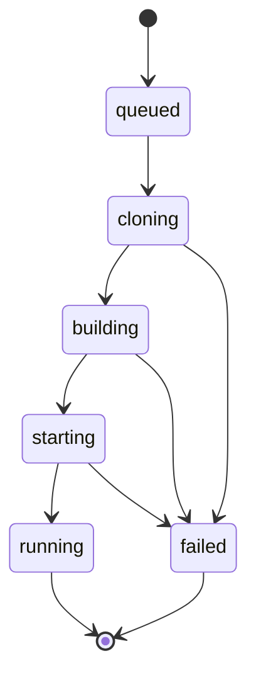

# Data model

Schema is created with `Base.metadata.create_all` (no migrations yet, see [TD-002](../tech-debt.md)).

## `apps`

| Column | Type | Constraints |
|--------|------|-------------|
| `id` | `uuid` | PK |
| `name` | `varchar(32)` | Unique, DNS label |
| `repo_url` | `text` | `https://` only |
| `branch` | `varchar(255)` | Default `main` |
| `created_at` | `timestamptz` | Server default |

## `deployments`

| Column | Type | Constraints |
|--------|------|-------------|
| `id` | `uuid` | PK |
| `app_id` | `uuid` | FK `apps.id`, `ON DELETE CASCADE`, indexed |
| `status` | `deploy_status` enum | See state machine |
| `commit_sha` | `varchar(40)` | Set after clone |
| `image` | `text` | `idp/<app>:<sha>` |
| `container_id` | `varchar(64)` | |
| `host_port` | `int` | Assigned by Docker |
| `error` | `text` | Set on `failed` |
| `created_at`, `updated_at` | `timestamptz` | |

## Deployment state machine

Each transition is a single `UPDATE` that also bumps `updated_at`. Rationale in [ADR-0003](../adr/0003-deployment-state-machine.md).
