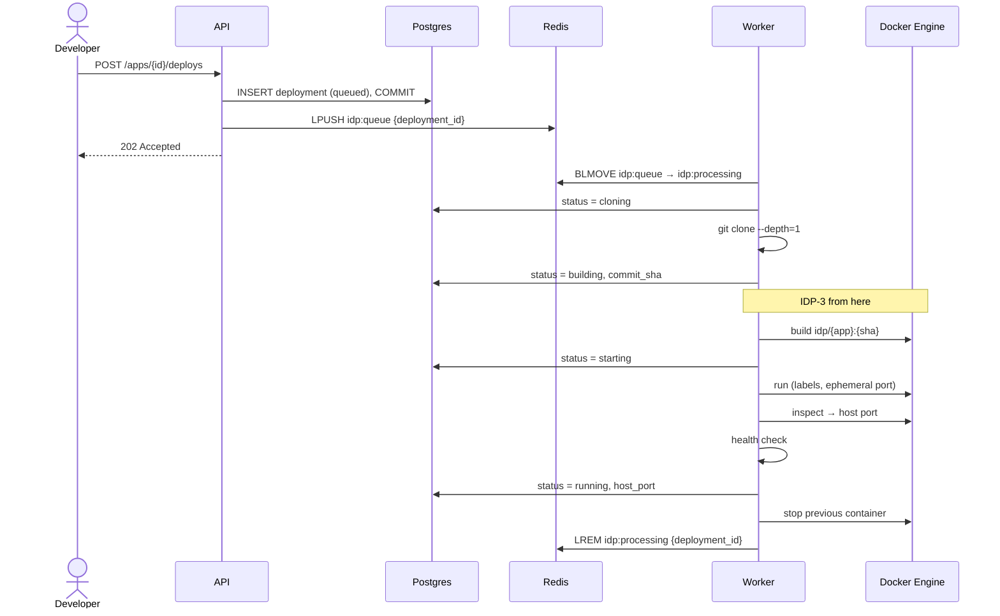

# Deployment flow

Status: implemented up to `building` (IDP-2). Build, run and health check are planned (IDP-3).

## Ordering

The deployment row is committed before its id is pushed to Redis ([ADR-0010](../adr/0010-persist-before-enqueue.md)). A failure between the two writes leaves a `queued` row that can be recovered from Postgres; the reverse order can lose jobs silently.

## Delivery semantics

- **At-least-once.** `BLMOVE` moves the id to `idp:processing` atomically. It is removed with `LREM` only after the job ends, successfully or not.
- **Idempotent clone.** A retried job may find a partial clone; `clone()` deletes the target directory first.
- **Crash recovery: not implemented.** After SIGKILL the id stays in `idp:processing` and the deployment stays in its last status. Nothing re-enqueues it ([GAP-001](../tech-debt.md#known-gaps)). Moving everything from `idp:processing` back to `idp:queue` on startup is not a fix: with more than one worker it steals jobs from live workers. The planned fix is a lease with heartbeat and a reaper.

## Failure handling

| Failure | Result |
|---------|--------|
| git exits non-zero | `failed`, `error` = git stderr (last 2000 characters) |
| Clone exceeds 120 s | `failed`, `error` = `clone timed out after 120s` |
| Any other exception | `failed`, `error` = `<ExceptionType>: <message>` |
| Worker killed | Deployment stuck, id left in `idp:processing` (GAP-001) |

The worker survives job failures; only the job is marked `failed`.

## Shutdown

On SIGTERM the worker finishes the current job, acknowledges it, and exits. Idle shutdown takes about one dequeue timeout (1 s). Jobs longer than `stop_grace_period` (30 s) are killed and behave like a crash ([ADR-0011](../adr/0011-worker-graceful-shutdown.md), [TD-007](../tech-debt.md)).
