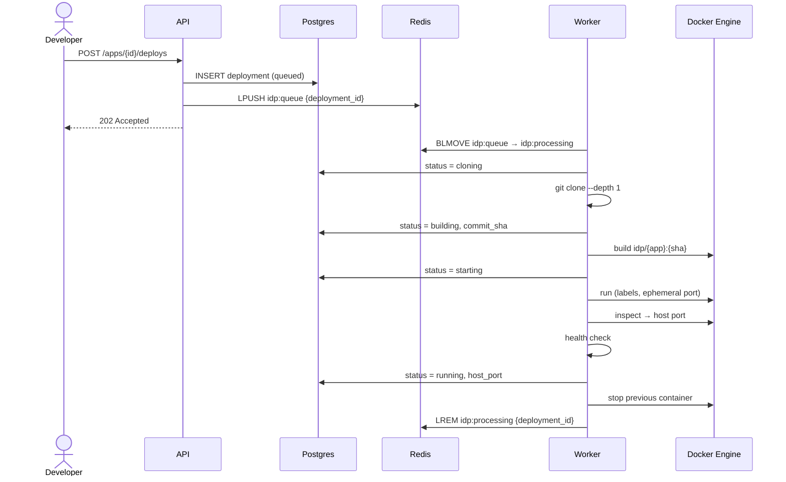

# Deployment flow

Status: planned (IDP-2, IDP-3).

## Delivery semantics

- **At-least-once.** A job is removed from `idp:processing` only after completion. A worker crash in between causes reprocessing, so every step must be idempotent ([ADR-0002](../adr/0002-redis-reliable-queue.md)).
- **Build context.** Sent to the engine as a tarball through the Docker SDK. No shared filesystem between the worker and the engine is required.

## Redeploy

The new container must pass its health check before the previous one is stopped. The stop sends SIGTERM, then SIGKILL after the grace period ([ADR-0009](../adr/0009-start-before-stop-redeploy.md)).
