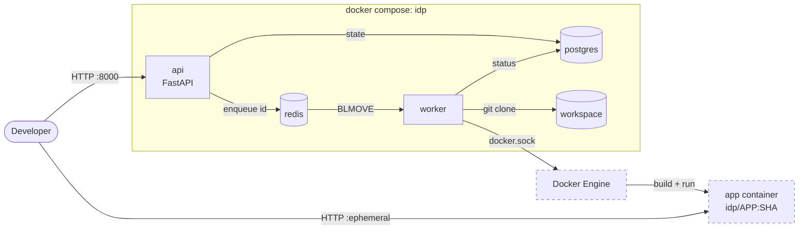

# Architecture overview — Stage 1

## Scope

Stage 1 runs locally on Docker Engine. No Kubernetes, no UI.

**Exit criterion:** an application registered through the API is running and serving on a host port within seconds of a deploy request.

## Progress

| Ticket | Scope | Status |
|--------|-------|--------|
| IDP-1 | Compose skeleton, application registration, schema | Done |
| IDP-2 | Deploy endpoint, Redis queue, worker with git clone | Done |
| IDP-3 | Image build, container run, health check, redeploy | Planned |

## System context

Dashed: planned (IDP-3).

## Components

| Component | Responsibility | Exposure | Docker access | Status |
|-----------|----------------|----------|---------------|--------|
| api | Accepts requests, persists state, enqueues jobs | Host `:8000` | No | Implemented |
| worker | Consumes jobs: clone, build, run, health check | None | Planned (IDP-3), via socket | Clone implemented; build and run planned |
| postgres | Source of truth for apps and deployments | Internal network | — | Implemented |
| redis | Job transport; later, log streams | Internal network | — | Implemented |
| app container | User workload, created by the worker outside the compose project | Host, ephemeral port | — | Planned |

`api` and `worker` share one image (`idp/platform:dev`) with different commands. The image includes git, which the api does not need ([TD-006](../tech-debt.md)).

## Trust boundaries

- `api` is the only network-facing platform component and holds no Docker privileges ([ADR-0005](../adr/0005-docker-access-worker-only.md)).
- `worker` has no Docker access in IDP-2. It receives `docker.sock`, and with it root-equivalent access to the host, in IDP-3 ([ADR-0006](../adr/0006-docker-socket-mount.md), [TD-001](../tech-debt.md)).
- `postgres` and `redis` publish no host ports.
- Platform containers run as non-root (UID 10001).
- User input reaching `git clone` is restricted to `https://` URLs, passed after `--`, with the branch as `--branch=<value>` ([API reference](../reference/api.md#validation)).

## Storage

| Data | Location | Reason |
|------|----------|--------|
| Source code | `/mnt/c/...` (Windows filesystem) | Read only at build time |
| Postgres data | Named volume `pgdata` | ext4 inside WSL; `/mnt/c` is slow and unreliable for fsync-heavy workloads |
| Worker workspace | Named volume `workspace` at `/workspace` | Same as above; one directory per deployment, never cleaned ([GAP-004](../tech-debt.md#known-gaps)) |

`/workspace` exists in the image, owned by `idp`. An empty named volume copies the ownership of the image directory on first mount; without it the mount point is root-owned and the worker cannot write.

The worker must not create bind mounts for app containers: paths passed through `docker.sock` resolve on the host, not inside the worker container.
